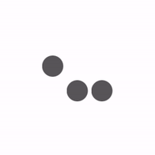
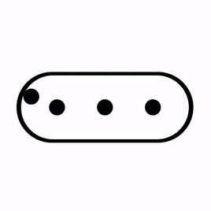
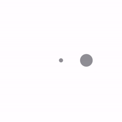
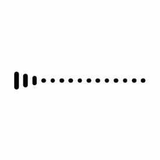
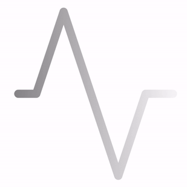

# ACTIVITY INDICATOR

# Contents

- Dots
    - [Swapping dots](#swapping-dots)
    - [Bouncing dots](#bouncing-dots)
    - [Slaloming dot](#slaloming-dot)
    - [Dotted circle](#dotted-circle)
    - [Infinite dots](#infinite-dots)
    - [Unamed dots](#unamed-dots)
- Rotating
    - [iOS activity indicator](#ios-activity-indicator)
    - [Rotating circle](#rotating-circle)
- Pulse
    - [Pulsing capsules](#pulsing-capsules)
    - [Pulsing line](#pulsing-line)
    
# Swapping dots

# Bouncing dots

# Slaloming dot

# Dotted circle

# Infinite dots

# Unamed dots

# iOS activity indicator

# Rotating circle

# Pulsing capsules

# Pulsing line

