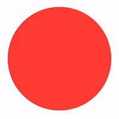

# CHECK BUTTONS

# Contents

- [Simple check button](#simple-check-button)
- [Filling check button](#filling-check-button)
- [Pie check button](#pie-check-button)
- [Flipping check button](#flipping-check-button)
- [Assembled check button](#assembled-check-button)

# Simple check button

# Filling check button

# Pie check button

# Flipping check button

<del>For this button, I had to implement a custom button since I did not find any way to disable the highlight on selecting a regular button.</del>

# Assembled check button

