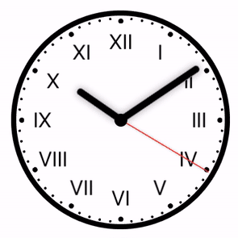
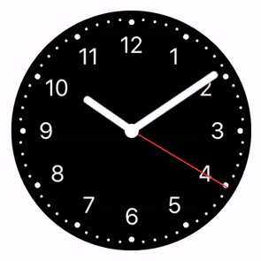

<h1>Clock</h1>

# Contents

- [Simple check button](#simple-check-button)
- [Filling check button](#filling-check-button)
- [Pie check button](#pie-check-button)
- [Flipping check button](#flipping-check-button)

