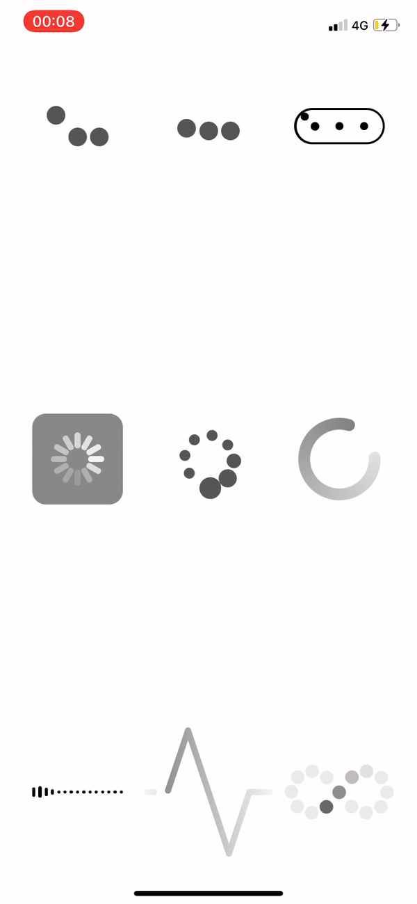

# Contents
- [Activity indicators](#activity-indicators)
- [Check buttons](#check-buttons)
- [Clock](#clock)
- [Digital clock](#digital-clock)
- [Menu buttons](#menu-buttons)
- [Rotating picker](#rotating-picker)

# Activity indicators

# Check buttons

# Clock

# Digital clock

# Menu buttons

# Rotating picker

Inspired by <a href="https://www.instagram.com/innappscoding/">InnAppsCoding</a>'s <a href="https://www.instagram.com/p/CAm_qd1ALbE/?igshid=hhqkv5q8yplk">rotating picker.

